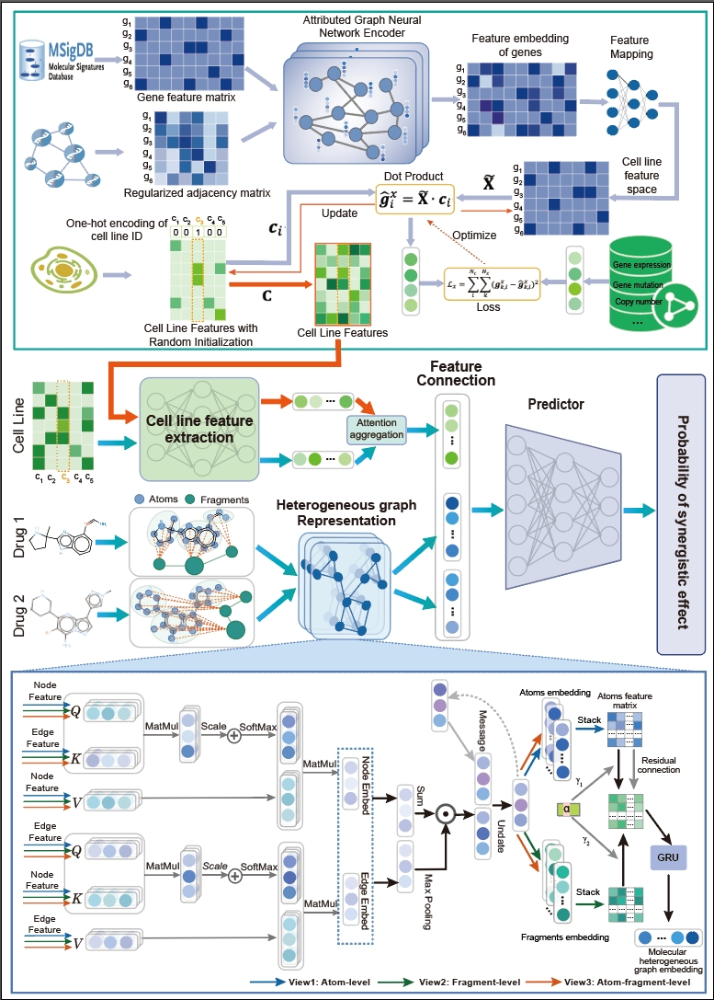

# Multisyn: A Multi-Source information Integration Approach for Synergistic Drug Combination Prediction

This repository contains the our implementation of the paper aboved.


# 1. Introduction

Our method, Multisyn, integrates pharmacophore information, PPI networks, and genomic data to predict synergistic anti-cancer drug combinations.

**Paper Link**:

<!-- Author Name et al., "Multisyn: Leveraging Graph Neural Networks for Synergistic Drug Combination Prediction", Journal Name, Year. -->

## 1.1 Features

- Represents molecules using heterogeneous molecular graphs.
- Predicts synergistic drug combinations using attributed graph neural networks.
- Integrates multiple cell line data sources: genomics and protein-protein interaction (PPI) networks.
- Provides interpretable results with an attention mechanism for substructure identification.

## 1.2 Results

## 1.3 Citation

If you find this repository helpful, please cite our work:

# 2. Item
## 2.1 Requirements

Our operating environment is as follows：
- Python 3.11.5
- Pytorch 2.1.0
- numpy 1.24.3
- Pytorch Geometric 2.4.0

## 2.2 File Description

This project contains six files for preprocessing, training, and evaluating drug combination prediction models.

The project is mainly divided into data processing, model definition, training, and evaluation.

- const.py: The const.py file defines variables for common file paths.    
- data_drug.py:process drug data, construct molecular graphs, and create datasets.  
- dataset_drug.py:process drug-target data and convert it into PyTorch Geometric format.   
- model_drug.py: Defines the model for drug molecular feature.   
- model.py:predict drug combination.  
- train.py: Main program for training the prediction model.    
- utils.py: loss functions, evaluation metrics, etc.  


## 2.3 Run
Preprocess the data by running:

When running for the first time, please run the file to create data. 

```bash
python data_drug.py
```

Train the model：
 ```bash
 python train.py
 ```
