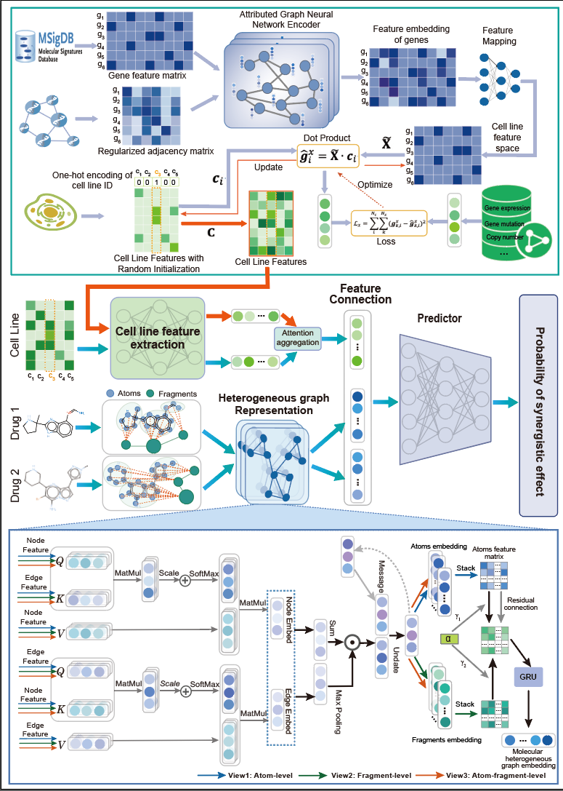

# Multisyn: Accurate prediction of synergistic drug combination using a multi-source information fusion framework

[](https://doi.org/10.5281/zenodo.15194129)

This repository contains the official implementation of our paper:  
**Multisyn** integrates pharmacophore structure, protein-protein interaction (PPI) networks, and cell line omics to predict synergistic anti-cancer drug combinations.



## 1. Introduction

Multisyn represents molecules as heterogeneous molecular graphs and predicts drug combination synergy using graph neural networks.  
It provides substructure-level attention and integrates multi-source data, including PPI and cell lines omics profiles.

**Paper Link**: *Coming soon...*

## 1.1 Features

- Drug heterogeneous molecular graph construction based on BRICS fragments  
-  Dual-view cell line integration: expression + PPI fusion features  
- Multi-modal attention-based GNN architecture  

## 1.2 File Structure

```text
multisyn/             ← Project root directory
├── setup.py          ← Packaging and installation configuration
├── requirements.txt  ← Dependency management
├── README.md         ← Project description
└── multisyn/         ← Python package directory (all core `.py` files are placed here)
    ├── __init__.py
    ├── model.py
    ├── train.py
    ├── utils.py
    ├── dataset.py
    ├── const.py
    └── prepare_data.py
```

## 1.3 Citation
If you find this repository helpful, please cite our work:

```bibtex

```

# 2. Usage
## 2.1 Requirements

Recommended Python environment:

```bash
Python ≥ 3.8
PyTorch ≥ 2.0
PyTorch Geometric ≥ 2.0
DGL ≥ 1.1
RDKit ≥ 2022.9.5
scikit-learn
pandas
numpy
scipy

```

Install dependencies:
```bash
pip install -r requirements.txt
```

## 2.2 Preprocessing
To preprocess the drug combination dataset:

```bash
python prepare_data.py
```

Processed files will be saved to `multisyn\datas\processed`.

## 2.3 Train the Model
To train the Multisyn model:
```bash
python train.py
```
Results will be saved to the `multisyn\datas\results` directory.
